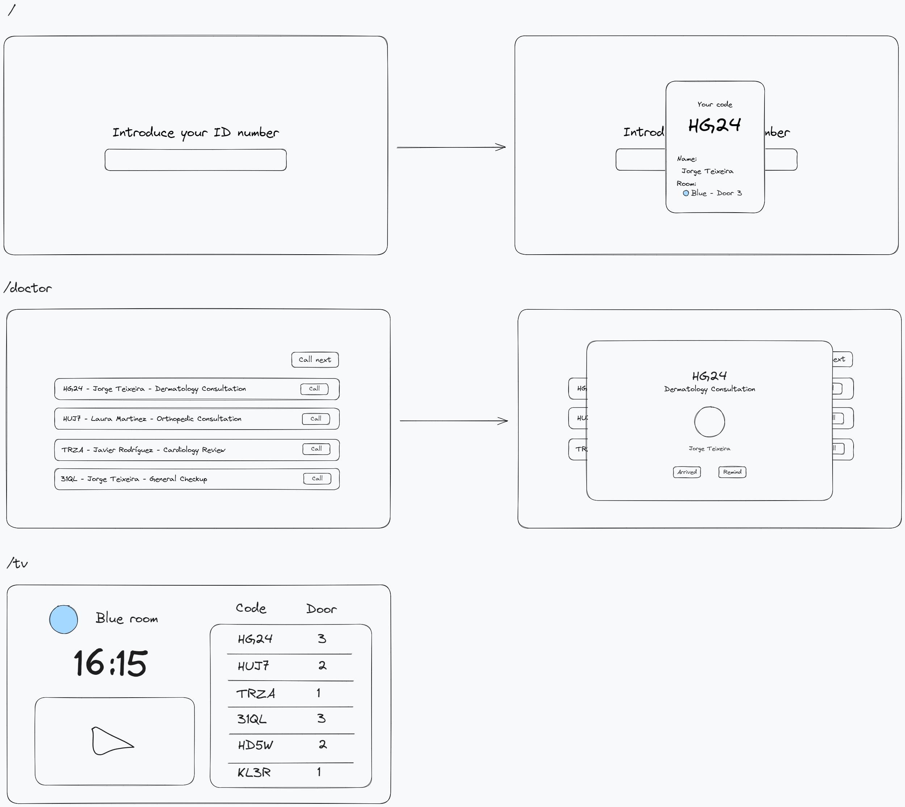

# Your App Name

## Overview
This repository contains the code for a two-part application: a frontend Svelte app and a backend Node.js server using Express and Socket.IO. The application is designed to streamline patient management in medical settings.

## Structure
- **Backend**: Node.js, Express, and Socket.IO.
- **Backend Folder**: Contains all server-side code, including API endpoints and real-time communication logic.
- **Frontend**: Svelte Framework.
- **Frontend Folder**: Contains all client-side code, featuring a modern and intuitive user interface.

## Frontend Paths
1. **Root (`/`)**: A simple and user-friendly login page where users input their ID to receive a ticket number.
2. **Doctor View (`/doctor`)**: An interface for doctors to view and call patients waiting in the waiting room.
3. **TV Display (`/tv`)**: A dedicated page for display in the waiting room, showing the patient calls and updates in real-time.

## Getting Started

> TODO
